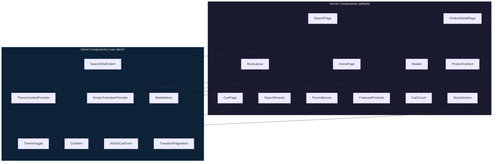
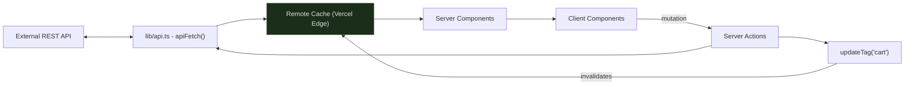

# Architecture

How the Vercel Swag Store is built and why these decisions were made.

---

## Monorepo

**Turborepo + pnpm workspaces** with two packages:

| Package | Path | Role |
| --- | --- | --- |
| `@repo/web` | `apps/web` | Next.js storefront |
| `@repo/ui` | `packages/ui` | Shared component library |

The monorepo keeps the storefront and its UI library in a single repository. Shared components, types, and styles live in one place - any change is immediately visible across the whole project without publishing packages or syncing versions.

Turborepo handles task orchestration. Build artifacts go into remote cache, so repeated CI runs skip work that's already been done. Task ordering through `dependsOn: ["^build"]` and `dependsOn: ["^check-types"]` guarantees the UI package is processed before the web app in each chain, while building and type-checking run as independent pipelines and don't block each other. A single `pnpm-lock.yaml` and `biome.jsonc` at the root keep dependency versions and code style consistent across packages.

pnpm's `workspace:*` protocol lets the web app consume the UI package as a direct source dependency with no publish step and instant feedback in dev. The non-flat `node_modules` layout prevents phantom dependencies. Content-addressable storage means shared deps like React and TypeScript are stored once on disk no matter how many packages use them.

This structure scales naturally as the project grows. A new storefront (e.g. `apps/mobile`), an admin panel (`apps/admin`), or a backend service (`apps/api`) can be dropped into the same repo and immediately consume shared packages — types, UI components, validation schemas — without any publishing ceremony. Turborepo's task graph automatically picks up new workspaces, so CI pipelines and caching extend to them for free. Teams working on different apps stay in one repository, which keeps cross-cutting changes (auth, shared types, design system updates) atomic and reviewable in a single pull request instead of being scattered across repos.

---

## Linting & Formatting

**Biome** handles both linting and formatting in one tool.

Biome runs linting and formatting in a single pass - one command, one config, one dependency. It covers JavaScript, TypeScript, JSX, CSS, and JSON, so there's no need for separate tools for each language. It also handles import sorting and JSX attribute ordering through its assist system.

The config extends three Ultracite presets (`core`, `react`, `next`) that provide a strict rule set out of the box: accessibility checks, no unused variables/imports with auto-fix, cognitive complexity limits, sorted Tailwind classes, barrel file prevention for better tree-shaking, and CSS validation. The project only adds two local overrides on top - single quotes and trailing commas.

Performance-wise, Biome is written in Rust and processes the full codebase in milliseconds. This makes it practical to run `pnpm check` on every commit without slowing down the workflow.

---

## Caching Strategy

All server data fetching uses the **`'use cache: remote'`** directive with explicit `cacheLife()` profiles.

The `remote` variant puts cache entries on the Vercel edge network, shared across all regions and all deployments. A new deploy doesn't blow away the cache - visitors get cached responses immediately. A cache entry written in one region is readable from any other, so users worldwide hit warm cache. Serverless isolates don't maintain their own copies, which cuts redundant memory usage and API calls.

### Cache Profiles

| Data | Profile | Rationale                                                                    |
| --- | --- |------------------------------------------------------------------------------|
| Product metadata & content | `hours` | Near-static catalog data that changes rarely                                 |
| Category list | `hours` | Only changes when the catalog is restructured                                |
| Featured products | `minutes` | Merchandising can rotate the selection at any time                           |
| Promotions | `minutes` | Have scheduled start/end times that need timely reflection                   |
| Search results | `minutes` | Must reflect newly added products and stock changes                          |
| Cart | `minutes` + `cacheTag('cart')` | Short TTL as a safety net, on-demand invalidation after every mutation       |
| Stock availability | **never cached** | Fetched fresh on every request, streamed via Suspense for real-time accuracy |

Cart mutations call `updateTag('cart')` after each write, which purges the cache entry across all edge nodes globally. The next read is guaranteed fresh. A short `minutes` TTL acts as a safety net, and tag-based purging handles instant consistency on the normal path - so users never see stale cart data.

### Component Caching

`cacheComponents: true` is enabled in Next.js config. This caches rendered Server Component trees alongside the data they consume - not just fetch results, but the entire JSX output. On cache hits, both the API call and the React rendering work are skipped.

---

## Server / Client Boundary

Everything is a Server Component by default. They fetch data, render HTML, and ship zero client JavaScript. Product listings, detail pages, and cart summaries are pure HTML - less JS for the browser to download and parse, direct API access without client-to-server roundtrips, and API tokens that never leave the server.

`'use client'` is added only where the browser is actually needed: form submissions, navigation transitions, theme toggling, search input state, and error boundaries.

---

## Data Flow

All communication with the external REST API goes through a single `apiFetch<T>()` wrapper. Deployment protection headers and cart tokens are injected automatically, every failure is parsed into a typed `ApiError` with `code`, `message`, and `status`, and generics propagate the expected response shape so contract mismatches are caught at compile time.

### Cart Token Lifecycle

The cart token lives in a cookie (`sameSite: lax`, 24h TTL matching the API-side expiry). It's deliberately not `httpOnly` - client-side JavaScript needs to read it for optimistic cart badge updates without an extra server roundtrip.

---

## Rendering Patterns

### Static Generation

`generateStaticParams` on the product detail page pre-renders all known slugs at build time, so product pages are served as static HTML from the CDN edge. Products added after deploy are handled at runtime through `use cache` and become warm for subsequent visitors.

### Suspense Streaming

```mermaid
%%{init: {'flowchart': {'nodeSpacing': 80, 'rankSpacing': 120}}}%%
graph TB
    subgraph HomePage ["Home Page"]
        HS["HTML Shell (instant)"]
        HS --> PB_S["⏳ PromoBanner"]
        HS --> Hero["Hero (static)"]
        HS --> FP_S["⏳ FeaturedProducts"]
    end

    subgraph SearchPage ["Search Page"]
        SS2["HTML Shell (instant)"]
        SS2 --> SShell["⏳ SearchShell (categories)"]
        SShell --> SRes["⏳ SearchResults (products)"]
    end

    subgraph ProductPage ["Product Detail"]
        PS["⏳ loading.tsx (route-level)"]
        PS --> PC2["ProductContent (cached)"]
        PC2 --> Stock["⏳ StockSection (fresh)"]
    end

    subgraph CartPage ["Cart Page"]
        CS["⏳ loading.tsx (route-level)"]
        CS --> CartContent["Cart items + order summary"]
    end

    subgraph HeaderComp ["Header (every page)"]
        HH["Nav + Logo (instant)"]
        HH --> CartB["⏳ CartCount (badge)"]
    end

    style PB_S fill:#2d1f0e,stroke:#8a6a2e,color:#e0e0e0
    style FP_S fill:#2d1f0e,stroke:#8a6a2e,color:#e0e0e0
    style SShell fill:#2d1f0e,stroke:#8a6a2e,color:#e0e0e0
    style SRes fill:#2d1f0e,stroke:#8a6a2e,color:#e0e0e0
    style PS fill:#2d1f0e,stroke:#8a6a2e,color:#e0e0e0
    style Stock fill:#2d1f0e,stroke:#8a6a2e,color:#e0e0e0
    style CS fill:#2d1f0e,stroke:#8a6a2e,color:#e0e0e0
    style CartB fill:#2d1f0e,stroke:#8a6a2e,color:#e0e0e0
```

> ⏳ = Suspense boundary with a co-located skeleton fallback

Every page streams its shell immediately, and async sections resolve independently. The user sees the page structure right away - hero, nav, headings render without waiting for data. A slow stock API doesn't block product images from appearing. Each Suspense boundary has a co-located skeleton that matches the final layout, which keeps CLS close to zero.

Route-level `loading.tsx` files in `/cart` and `/products/[param]` cover full-page navigations when the entire page is a cache miss.

---

## Error Handling

Two tiers. Route-level `error.tsx` catches errors within a page segment and shows a recovery UI ("Try again" / "Go home") while the root layout stays intact - header, footer, theme all keep working. Root-level `global-error.tsx` catches failures that break the layout itself and renders its own `<html>`/`<body>` shell so the user never sees a blank browser error page.

On top of that, every `use cache` block wraps its API call in `try/catch` and returns `null` on failure. Sections like the promo banner or featured products quietly disappear instead of crashing the whole page. A broken section doesn't take down unrelated content.

---

## Theming

**`next-themes`** with `attribute="class"` and `defaultTheme="dark"`.

The class-based approach maps directly to Tailwind's `dark:` variant - one `.dark` class on `<html>`, one reflow, no extra CSS layers. `enableSystem` is off on purpose: this is a brand store, and the palette needs to look the same in every screenshot, demo, and marketing context regardless of what the visitor's OS prefers.

Design tokens use the oklch color space, which is perceptually uniform. "50% lightness" actually looks like 50% lightness regardless of hue, so hover states, disabled states, and other adjustments stay visually consistent.

Tokens are split into two layers:

1. **Base** (`@repo/ui/globals.css`) - core palette shared across the monorepo
2. **App** (`apps/web/globals.css`) - imports the base, adds semantic colors (`--success`, `--warning`, `--danger`) and dark-mode overrides

The theme toggle also updates `meta[name="theme-color"]` so the browser chrome on mobile matches the active theme.

---

## Typography

**Geist Sans** - Vercel's own typeface, loaded through `next/font`.

Geist reinforces the brand. `next/font` self-hosts the files and applies `size-adjust` at build time, so there's no flash of unstyled text, no CLS from font swaps, and no external requests blocking render.

---

## Navigation & Transitions

`RouterTransitionProvider` wraps `router.push` in React's `useTransition`, and all navigations go through the `navigate()` function it exposes via context.

The current page stays fully interactive while the next route loads - no frozen buttons, no unresponsive scroll. `isPending` is available from context, so any component can show a loading indicator without prop drilling.

The same `useTransition` pattern shows up in two more places:

- **`useAction` hook** - wraps Server Action calls, giving components an `isPending` flag for optimistic UI ("Adding..." on the cart button)
- **`TransitionPagination`** - composes the server-rendered Pagination with `useRouterTransition` for non-blocking page switches in search results

---

## Image Optimization

Product images live on **Vercel Blob Storage** and go through **`next/image`**.

Format negotiation happens automatically - WebP/AVIF based on browser support, 25-50% smaller payloads. Responsive `srcSet` means phones don't download desktop-sized files. Resizing happens on the edge at request time, so new product images work right away without a redeploy. `remotePatterns` in the Next.js config allowlists only the Blob Storage domain to prevent the optimization endpoint from being used with arbitrary URLs.

---

## UI Component Architecture

The UI package is built on **shadcn/ui** - components generated via CLI into `@repo/ui` as source-owned copies. There's no `shadcn` runtime dependency in `package.json`. Full control over markup and behavior, no version lock-in, and natural tree-shaking since unused components are just files that never get imported.

Visual variants use **CVA** (class-variance-authority) for type-safe variant definitions with automatic type inference. The `cn()` utility chains `clsx` → `tailwind-merge` to handle conditional classes and deduplicate conflicting Tailwind utilities. Without `tailwind-merge`, passing `className="p-4"` to a component that already has `p-2` would produce unpredictable results.

---

## SEO & Metadata

The Next.js Metadata API handles all `<head>` management. It deduplicates and orders meta tags correctly, supports `title.template` so every page gets " | Vercel Swag Store" appended, and derives `metadataBase` from `VERCEL_PROJECT_PRODUCTION_URL` so OG image URLs are correct in both production and preview deployments.

Product pages generate dynamic OG tags with product images via `generateMetadata`. Cart and 404 pages set `robots: { index: false }` to keep them out of search indexes.

---

## Analytics

**Vercel Speed Insights** is rendered in the root layout.

It collects Core Web Vitals (LCP, CLS, INP) from real visitors and reports them to the Vercel dashboard with per-route breakdowns. The tracking script lazy-loads so it doesn't affect page load.
